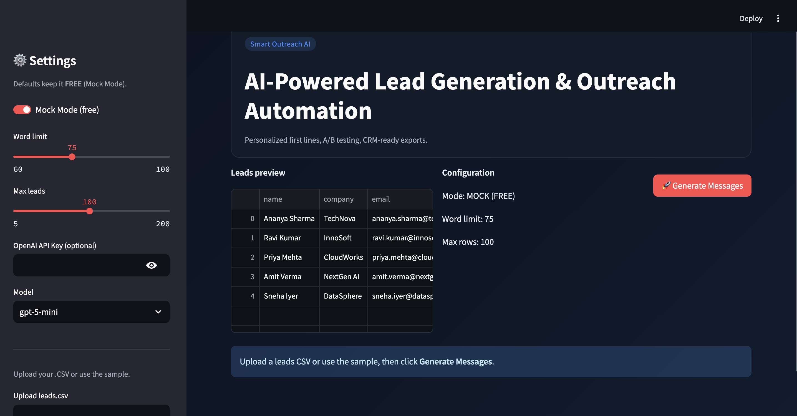
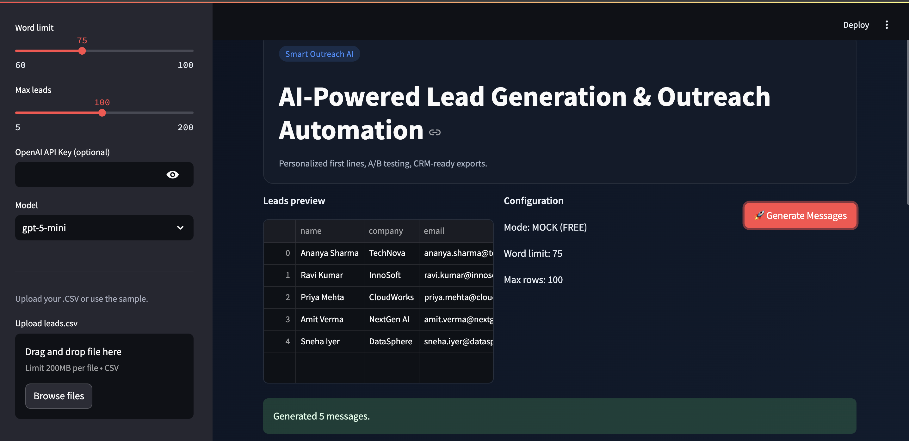
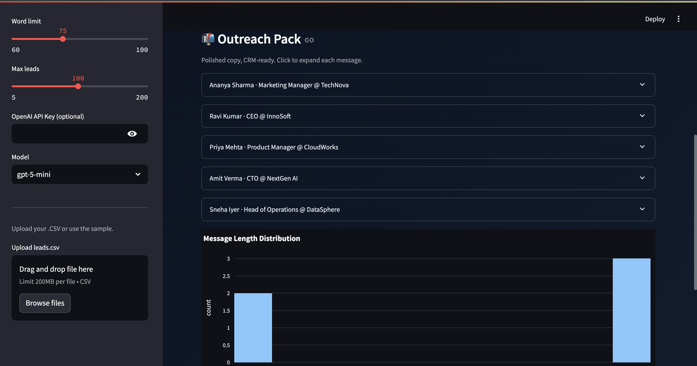
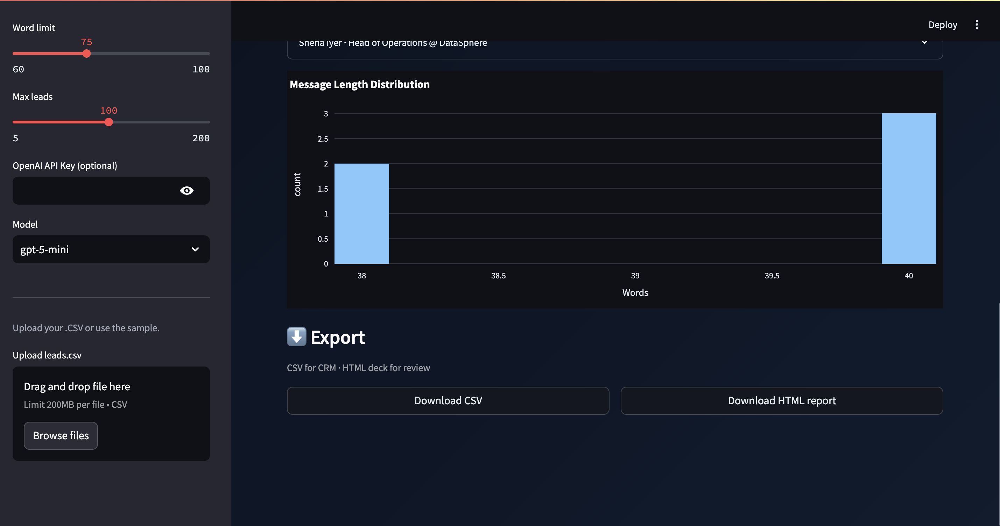

# 🚀 Smart Outreach AI

AI-powered lead generation and outreach automation. Generate personalized first lines, run A/B tests, and export CRM-ready reports with ease.

---

## 📌 Features
- 🤖 **AI-Powered Personalization** – Generate tailored outreach messages using GPT models.  
- 📂 **CSV Import & Export** – Upload leads in CSV format and export CRM-ready results.  
- 📊 **Analytics Dashboard** – Visualize message length distributions and insights.  
- ⚙️ **Configurable Settings** – Adjust word limits, max leads, and select models.  
- 🔒 **Mock & Live Modes** – Use free Mock Mode for testing or connect with your own OpenAI API key.  

---

## 📷 Screenshots

### Upload & Configure


### Generate Messages


### Outreach Pack


### Analytics & Export


### Exported Results (CSV)


---

## 📂 Project Structure
```

smart-outreach-ai/
│── data/                   # Input & output CSV files
│   ├── leads.csv            # Sample input leads
│   └── outreach\_results.csv # Generated outreach results
│── screenshots/             # App screenshots
│── scripts/                 # Utility scripts
│── templates/               # HTML templates (reports)
│── app.py                   # Main application
│── test\_api.py              # API testing script
│── requirements.txt         # Python dependencies
│── README.md                # Project documentation
│── LICENSE                  # Open-source license
│── .gitignore               # Ignored files

````

---

## ⚡ Getting Started

### 1. Clone the Repository
```bash
git clone https://github.com/KarmMehta/smart-outreach-ai.git
cd smart-outreach-ai
````

### 2. Create Virtual Environment

```bash
python3 -m venv .venv
source .venv/bin/activate   # Mac/Linux
.venv\Scripts\activate      # Windows
```

### 3. Install Dependencies

```bash
pip install -r requirements.txt
```

### 4. Run the App

```bash
streamlit run app.py
```

---

## 🛠️ Usage

1. Upload your leads CSV (`name`, `company`, `email`, `role`).
2. Configure **word limit, number of leads, and AI model**.
3. Click **Generate Messages** to create outreach copy.
4. View generated results in **Outreach Pack** with analytics.
5. Export results as **CSV or HTML report**.

---

## 🧪 Example Workflow

1. Upload sample `leads.csv`
2. Generate personalized messages
3. Preview results in the Outreach Pack
4. Export to `outreach_results.csv`

**Sample Output:**

```csv
name,company,email,role,outreach_message
Ananya Sharma,TechNova,ananya.sharma@technova.com,Marketing Manager,Hi Ananya, excited to connect with TechNova’s marketing vision...
Ravi Kumar,InnoSoft,ravi.kumar@innosoft.com,CEO,Hi Ravi, I admire your leadership at InnoSoft, here’s something that could help...
```

---

## 🔧 Configuration

* **Mock Mode**: Default, free to use without API key.
* **OpenAI API Key**: Add your key in settings for real generations.
* **Model Options**: `gpt-5-mini`, `gpt-4`, etc.
* **Word Limit**: Adjustable from **60–100 words**.
* **Max Leads**: Adjustable up to **200 leads**.

---

## 📜 License

This project is licensed under the MIT License – see the [LICENSE](LICENSE) file for details.

---

## 🤝 Contributing

Contributions are welcome!

1. Fork the repo
2. Create a new branch (`feature/your-feature`)
3. Commit your changes
4. Open a pull request

---

## ⭐ Support

If you like this project, consider giving it a ⭐ on [GitHub](https://github.com/KarmMehta/smart-outreach-ai)!

```